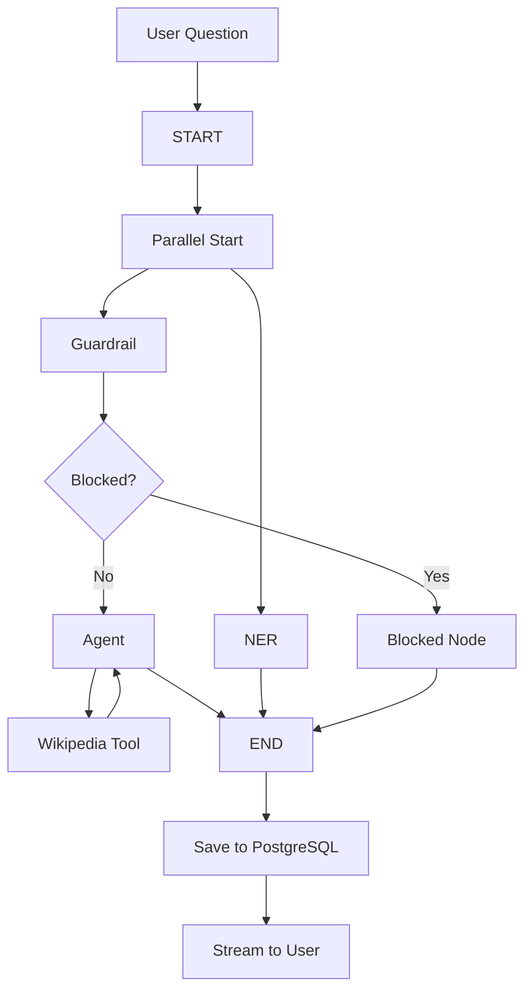
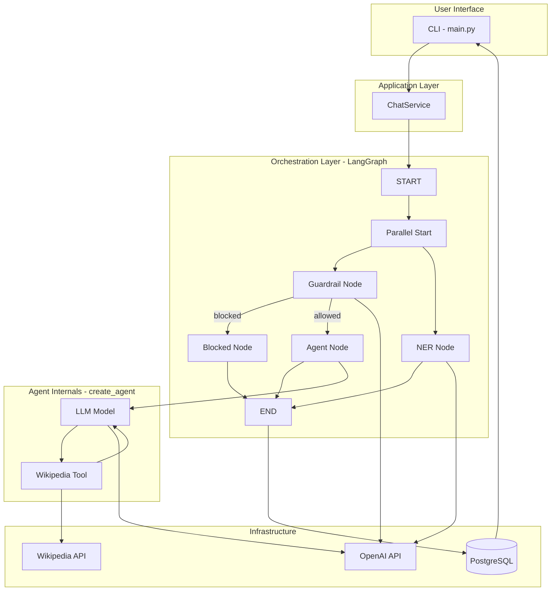
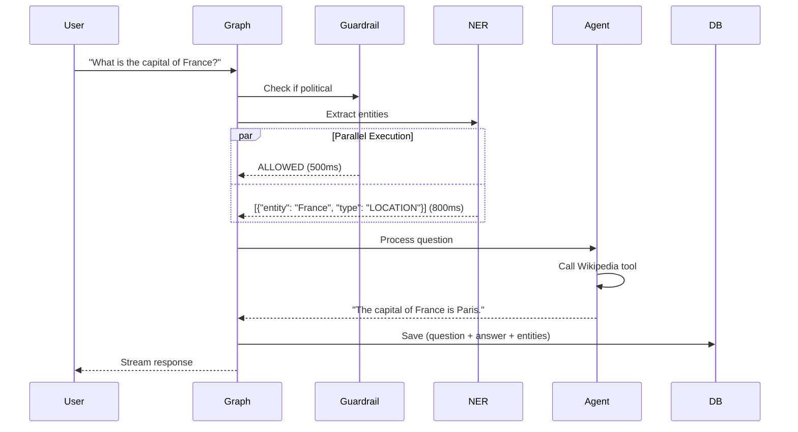
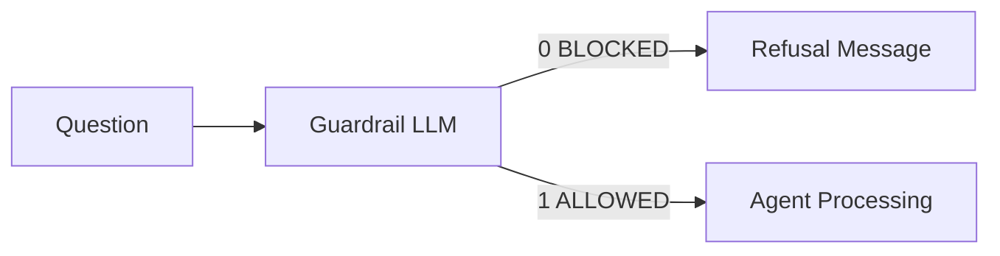
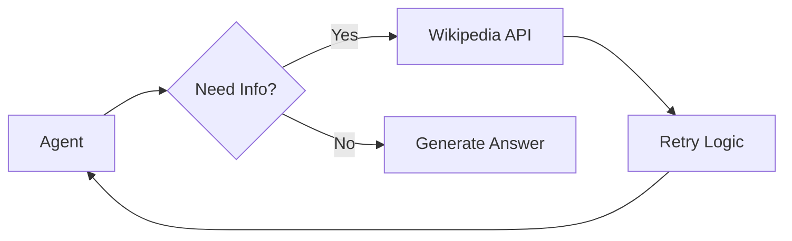
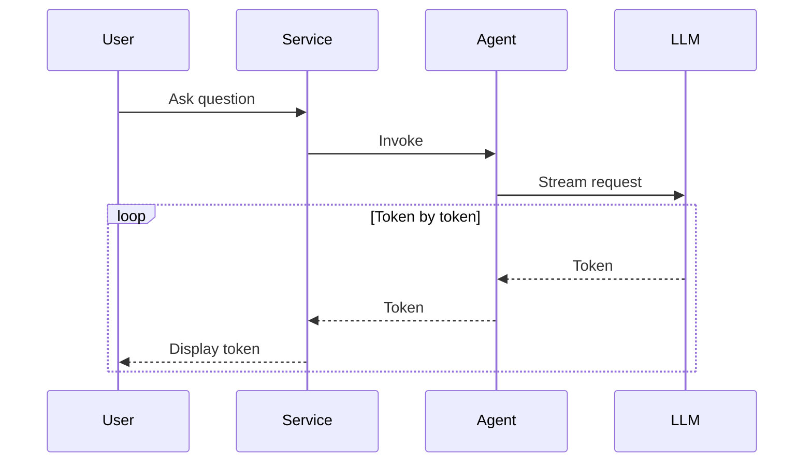
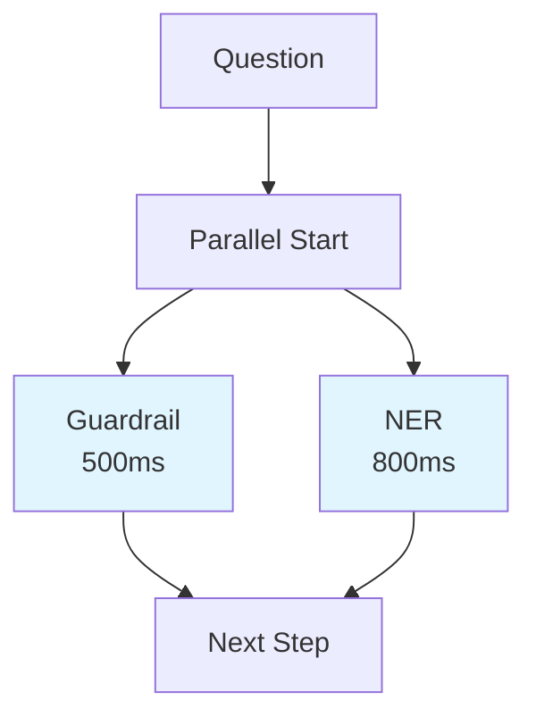
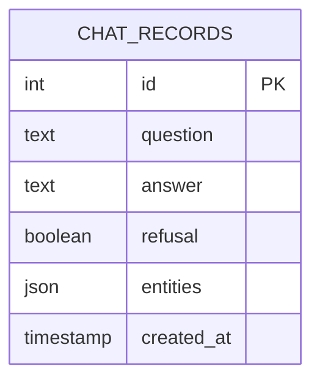

# Groot Chatbot

A production-ready LangGraph chatbot with guardrails, Wikipedia search, streaming responses, parallel NER processing, and PostgreSQL persistence.

## Overview

Groot is an intelligent chatbot that:
- **Blocks political questions** using an LLM-based guardrail
- **Searches Wikipedia** for factual information
- **Streams responses** token-by-token for better UX
- **Extracts named entities** in parallel (PERSON, LOCATION, ORGANIZATION, DATE, OTHER)
- **Stores everything** in PostgreSQL with rich metadata

## Architecture

### High-Level Flow



### Detailed Architecture



### Parallel Execution



## Key Features

### 1. Guardrail System

Blocks political questions before processing:



**Example:**
- Input: "Who should I vote for?"
- Output: "I'm sorry, I'm not able to discuss political topics."
- Database: `refusal=true`, entities extracted

### 2. Wikipedia Search Tool

Automatically searches Wikipedia when needed:



**Features:**
- Automatic retry with exponential backoff
- Configurable timeout (default: 30s)
- Returns top 5 results by default

### 3. Streaming Responses

Token-by-token streaming for better UX:



### 4. Parallel NER Processing

Named Entity Recognition runs in parallel with guardrail:



**Entity Types:**
- PERSON (e.g., "Albert Einstein")
- LOCATION (e.g., "France", "Paris")
- ORGANIZATION (e.g., "Microsoft", "NASA")
- DATE (e.g., "2024", "January")
- OTHER (anything else)

### 5. PostgreSQL Persistence

All interactions stored with rich metadata:



**Example Record:**
```json
{
  "id": 1,
  "question": "What is the capital of France?",
  "answer": "The capital of France is Paris.",
  "refusal": false,
  "entities": [
    {"entity": "France", "type": "LOCATION"}
  ],
  "created_at": "2025-04-15T10:30:00Z"
}
```

## Installation

### Prerequisites

- Python 3.13+
- Docker (for PostgreSQL)
- OpenAI API key

### Setup

1. **Clone the repository**
```bash
git clone <repository-url>
cd Groot
```

2. **Create virtual environment**
```bash
uv create venv
source .venv/bin/active
```

3. **Install dependencies**
```bash
uv sync
```

4. **Start PostgreSQL**
```bash
docker-compose up -d
```

5. **Configure environment**
```bash
cp .env.example .env
# Edit .env and add your configurations
```
