# Groot Chatbot

A production-ready LangGraph chatbot with guardrails, Wikipedia search, streaming responses, parallel NER processing, and PostgreSQL persistence.

## Overview

Groot is an intelligent chatbot that:
- **Blocks political questions** using an LLM-based guardrail
- **Searches Wikipedia** for factual information
- **Streams responses** token-by-token for better UX
- **Extracts named entities** in parallel (PERSON, LOCATION, ORGANIZATION, DATE, OTHER)
- **Stores everything** in PostgreSQL with rich metadata

## Architecture

### High-Level Flow

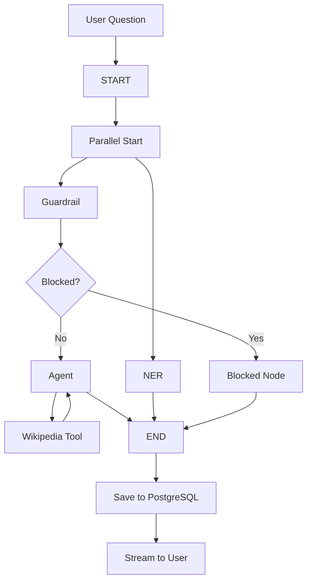

### Detailed Architecture

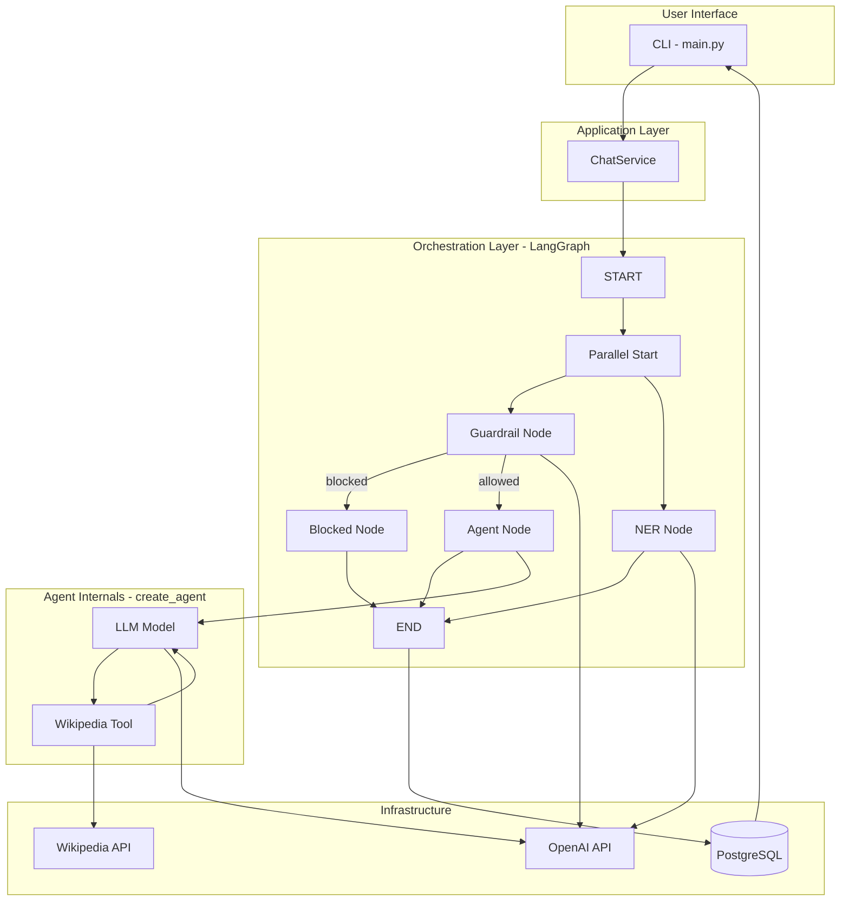

### Parallel Execution

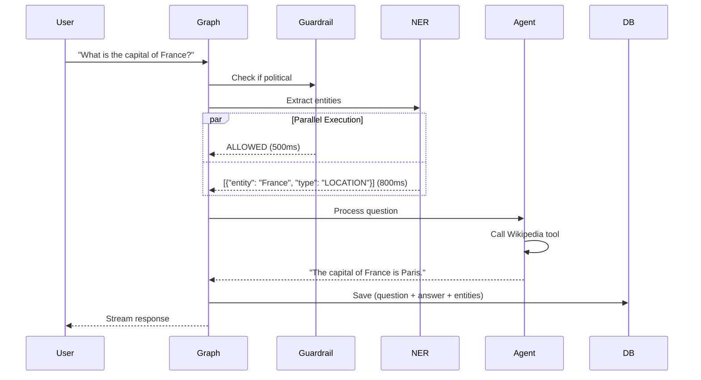

## Key Features

### 1. Guardrail System

Blocks political questions before processing:

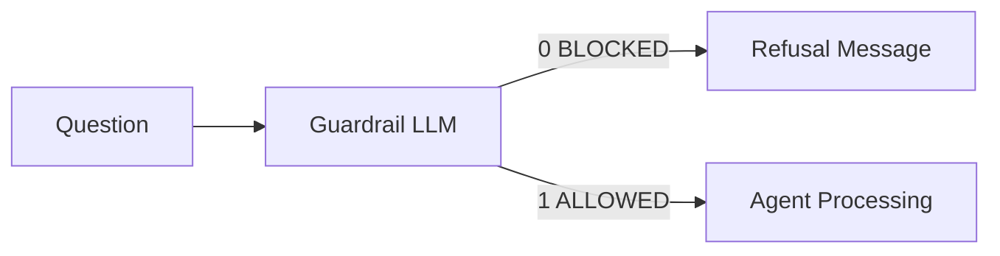

**Example:**
- Input: "Who should I vote for?"
- Output: "I'm sorry, I'm not able to discuss political topics."
- Database: `refusal=true`, entities extracted

### 2. Wikipedia Search Tool

Automatically searches Wikipedia when needed:

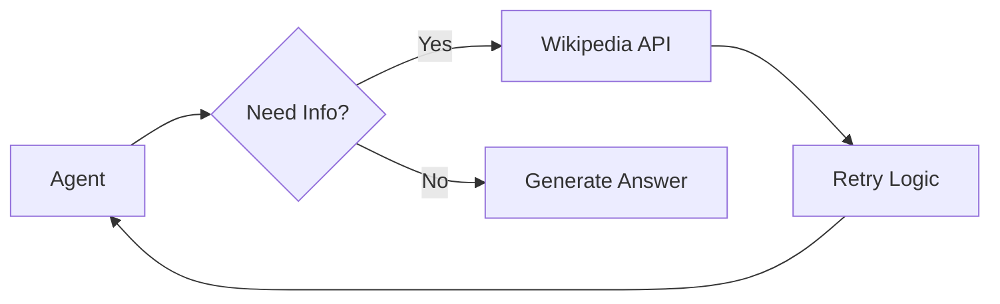

**Features:**
- Automatic retry with exponential backoff
- Configurable timeout (default: 30s)
- Returns top 5 results by default

### 3. Streaming Responses

Token-by-token streaming for better UX:

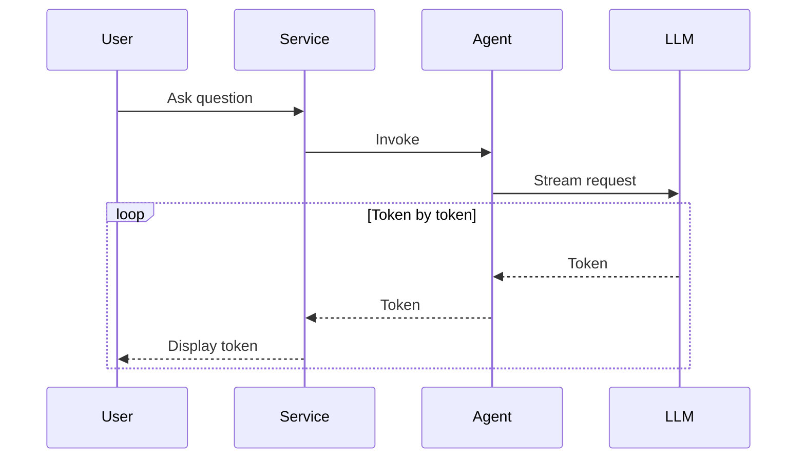

### 4. Parallel NER Processing

Named Entity Recognition runs in parallel with guardrail:

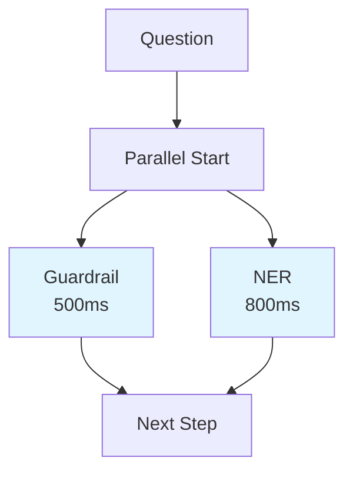

**Entity Types:**
- PERSON (e.g., "Albert Einstein")
- LOCATION (e.g., "France", "Paris")
- ORGANIZATION (e.g., "Microsoft", "NASA")
- DATE (e.g., "2024", "January")
- OTHER (anything else)

### 5. PostgreSQL Persistence

All interactions stored with rich metadata:

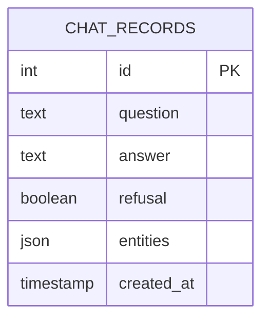

**Example Record:**
```json
{
  "id": 1,
  "question": "What is the capital of France?",
  "answer": "The capital of France is Paris.",
  "refusal": false,
  "entities": [
    {"entity": "France", "type": "LOCATION"}
  ],
  "created_at": "2025-04-15T10:30:00Z"
}
```

## Project Structure

```
groot-chatbot/
├── src/
│   └── groot/
│       ├── chat/
│       │   ├── application/
│       │   │   └── services.py          # ChatService (streaming)
│       │   ├── domain/
│       │   │   └── entities.py          # ChatRequest, ChatResponse
│       │   ├── infrastructure/
│       │   │   ├── llm/
│       │   │   │   ├── client.py        # LLM client with retry
│       │   │   │   └── error.py         # LLM errors
│       │   │   ├── persistence/
│       │   │   │   ├── models.py        # ChatRecord model
│       │   │   │   ├── repository.py    # Database operations
│       │   │   │   ├── session.py       # DB session
│       │   │   │   └── init_db.py       # DB initialization
│       │   │   └── tools/
│       │   │       └── wikipedia.py     # Wikipedia search tool
│       │   └── orchestration/
│       │       ├── graph.py             # LangGraph workflow
│       │       ├── state.py             # GraphState definition
│       │       ├── error.py             # Orchestration errors
│       │       └── nodes/
│       │           ├── guardrail.py     # Political classifier
│       │           ├── blocked.py       # Refusal handler
│       │           ├── agent.py         # Main agent (create_agent)
│       │           └── ner.py           # Entity extraction
│       └── shared/
│           ├── config/
│           │   └── settings.py          # Configuration
│           └── logging/
│               └── setup.py             # Logging setup
├── main.py                              # CLI entry point
├── docker-compose.yml                   # PostgreSQL setup
├── pyproject.toml                       # Dependencies
└── .env                                 # Environment variables
```

## Installation

### Prerequisites

- Python 3.13+
- Docker (for PostgreSQL)
- OpenAI API key

### Setup

1. **Clone the repository**
```bash
git clone <repository-url>
cd groot-chatbot
```

2. **Create virtual environment**
```bash
python -m venv .venv
source .venv/bin/activate  # On Windows: .venv\Scripts\activate
```

3. **Install dependencies**
```bash
pip install -e .
```

4. **Start PostgreSQL**
```bash
docker-compose up -d
```

5. **Configure environment**
```bash
cp .env.example .env
# Edit .env and add your OpenAI API key
```

**Required environment variables:**
```bash
OPENAI_API_KEY=your_api_key_here
POSTGRES_USER=groot
POSTGRES_PASSWORD=password
POSTGRES_DB=groot_db
```

## Usage

### Run the Chatbot

```bash
python main.py
```

### Example Interactions

**1. Normal Question (Allowed)**
```
You: What is the capital of France?
Bot: The capital of France is Paris.
```

**Database:**
```json
{
  "question": "What is the capital of France?",
  "answer": "The capital of France is Paris.",
  "refusal": false,
  "entities": [{"entity": "France", "type": "LOCATION"}]
}
```

**2. Political Question (Blocked)**
```
You: Who should I vote for?
Bot: I'm sorry, I'm not able to discuss political topics.
```

**Database:**
```json
{
  "question": "Who should I vote for?",
  "answer": "I'm sorry, I'm not able to discuss political topics.",
  "refusal": true,
  "entities": []
}
```

**3. Question with Wikipedia Tool**
```
You: Tell me about Albert Einstein
Bot: Albert Einstein was a theoretical physicist who developed 
     the theory of relativity...
```

**Database:**
```json
{
  "question": "Tell me about Albert Einstein",
  "answer": "Albert Einstein was a theoretical physicist...",
  "refusal": false,
  "entities": [{"entity": "Albert Einstein", "type": "PERSON"}]
}
```

## How It Works

### Request Flow

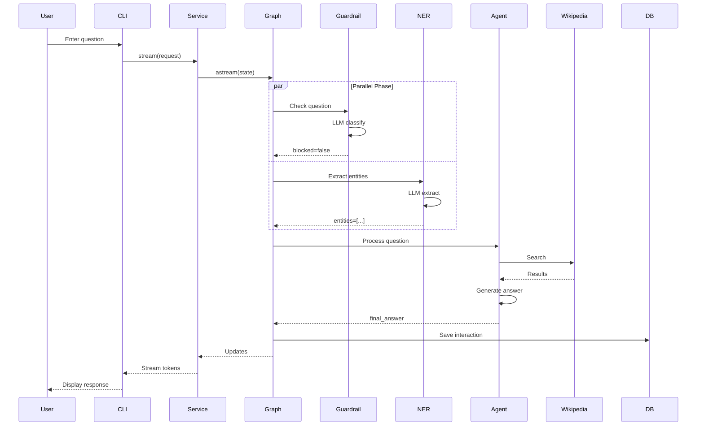

### State Management

The graph maintains state through `GraphState`:

```python
class GraphState(TypedDict):
    question: str                          # User's question
    messages: Annotated[list, add_messages]  # Conversation history
    blocked: bool | None                   # Guardrail verdict
    final_answer: str | None               # Agent's response
    stream_chunk: str | None               # Streaming token
    entities: list[dict[str, str]] | None  # NER results
```

### Node Execution

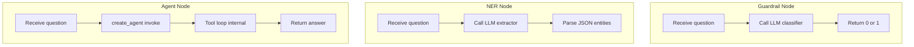

## Configuration

### Environment Variables

```bash
# OpenAI Configuration
OPENAI_API_KEY=your_api_key
OPENAI_BASE_URL=https://api.openai.com/v1
OPENAI_MODEL=gpt-4
OPENAI_TEMPERATURE=0.0

# Database Configuration
POSTGRES_USER=groot
POSTGRES_PASSWORD=password
POSTGRES_HOST=localhost
POSTGRES_PORT=5432
POSTGRES_DB=groot_db

# Guardrail Configuration
POLITICAL_REFUSAL_MESSAGE="I'm sorry, I'm not able to discuss political topics."

# Wikipedia Configuration
WIKIPEDIA_SEARCH_URL=https://en.wikipedia.org/w/api.php
WIKIPEDIA_REQUEST_TIMEOUT_SECONDS=30
WIKIPEDIA_SEARCH_RESULT_LIMIT=5

# Retry Configuration
LLM_CALL_RETRY_ATTEMPT=3
LLM_CALL_RETRY_MIN_WAIT=1
LLM_CALL_RETRY_MAX_WAIT=10

# Logging
LOG_LEVEL=INFO
```

## Database Queries

### View All Interactions
```sql
SELECT id, question, refusal, entities, created_at 
FROM chat_records 
ORDER BY created_at DESC 
LIMIT 10;
```

### View Blocked Questions
```sql
SELECT question, entities, created_at 
FROM chat_records 
WHERE refusal = true
ORDER BY created_at DESC;
```

### Find Questions with Specific Entity Type
```sql
SELECT question, entities 
FROM chat_records 
WHERE entities @> '[{"type": "PERSON"}]'::jsonb
ORDER BY created_at DESC;
```

### Most Common Entities
```sql
SELECT 
    jsonb_array_elements(entities)->>'entity' as entity,
    jsonb_array_elements(entities)->>'type' as type,
    COUNT(*) as count
FROM chat_records
WHERE entities IS NOT NULL
GROUP BY entity, type
ORDER BY count DESC
LIMIT 20;
```

### Entity Distribution by Type
```sql
SELECT 
    jsonb_array_elements(entities)->>'type' as entity_type,
    COUNT(*) as count
FROM chat_records
WHERE entities IS NOT NULL
GROUP BY entity_type
ORDER BY count DESC;
```

## Testing

### Manual Testing
```bash
python main.py
```

Try these test cases:
1. "What is Python?" (should work)
2. "Who should I vote for?" (should be blocked)
3. "Tell me about Paris" (should use Wikipedia)
4. "What is the capital of France?" (should extract entities)

### Automated Testing
```bash
python test_implementation.py
```

## Performance

### Latency Breakdown

```mermaid
gantt
    title Request Processing Timeline
    dateFormat X
    axisFormat %Lms
    
    section Parallel Phase
    Guardrail     :0, 500
    NER          :0, 800
    
    section Agent Phase
    Agent        :800, 3300
    
    section Storage
    Database     :3300, 3350
```

**Typical Latencies:**
- Guardrail: ~500ms
- NER: ~800ms (parallel, doesn't block)
- Agent: ~2-5s (depends on tool usage)
- Database: ~50ms
- **Total**: ~3-5s for allowed questions, ~800ms for blocked

### Optimization Tips

1. **Use faster models** for guardrail/NER (e.g., `gpt-3.5-turbo`)
2. **Cache frequent questions** with Redis
3. **Batch database writes** for high volume
4. **Use async** for parallel LLM calls

## Troubleshooting

### Database Connection Error
```bash
# Check if PostgreSQL is running
docker-compose ps

# Restart if needed
docker-compose restart

# Check logs
docker-compose logs postgres
```

### OpenAI API Error
```bash
# Verify API key
echo $OPENAI_API_KEY

# Test API connection
curl https://api.openai.com/v1/models \
  -H "Authorization: Bearer $OPENAI_API_KEY"
```

### Import Errors
```bash
# Reinstall dependencies
pip install -e .

# Check Python version
python --version  # Should be 3.13+
```

### Guardrail Not Working
- Check `GUARDRAIL_PROMPT` in settings
- Verify LLM model supports classification
- Review logs for LLM errors

### NER Not Extracting Entities
- Check if question contains entities
- Verify LLM model supports JSON output
- Review NER prompt in `nodes/ner.py`

## Development

### Adding New Tools

1. Create tool in `src/groot/chat/infrastructure/tools/`
2. Add to agent in `nodes/agent.py`:
```python
_agent = create_agent(
    model=build_chat_model(),
    tools=[wikipedia_search, your_new_tool],
    system_prompt=settings.system_prompt,
)
```

### Adding New Entity Types

Edit `nodes/ner.py` and update the prompt:
```python
"Classify each entity into one of: PERSON, LOCATION, ORGANIZATION, DATE, PRODUCT, OTHER"
```

### Customizing Guardrail

Edit `settings.py` and modify `GUARDRAIL_PROMPT`:
```python
GUARDRAIL_PROMPT = """
Your custom guardrail logic here...
"""
```

## Contributing

1. Fork the repository
2. Create a feature branch
3. Make your changes
4. Add tests
5. Submit a pull request

## License

MIT License - see LICENSE file for details

## Documentation

- **IMPLEMENTATION.md** - Detailed implementation guide
- **ARCHITECTURE_V2.md** - Architecture deep dive
- **QUICK_START.md** - Quick start guide
- **CHANGES.md** - Change log
- **FINAL_SUMMARY.md** - Implementation summary

## Support

For issues or questions:
1. Check the documentation
2. Review logs for error messages
3. Verify configuration
4. Open an issue on GitHub

---

**Built with:**
- [LangGraph](https://github.com/langchain-ai/langgraph) - Workflow orchestration
- [LangChain](https://github.com/langchain-ai/langchain) - LLM integration
- [OpenAI](https://openai.com) - Language models
- [PostgreSQL](https://www.postgresql.org) - Database
- [SQLAlchemy](https://www.sqlalchemy.org) - ORM

**Status:** Production Ready ✅
